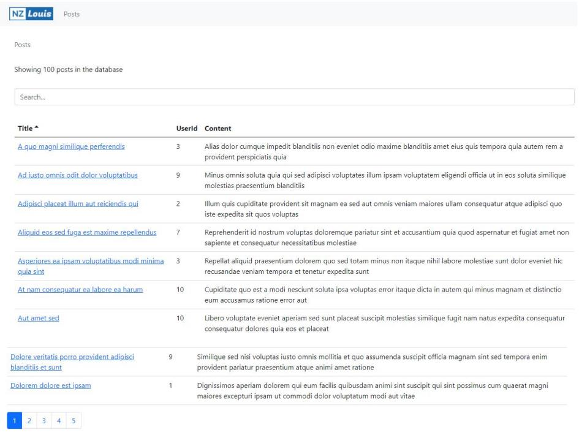
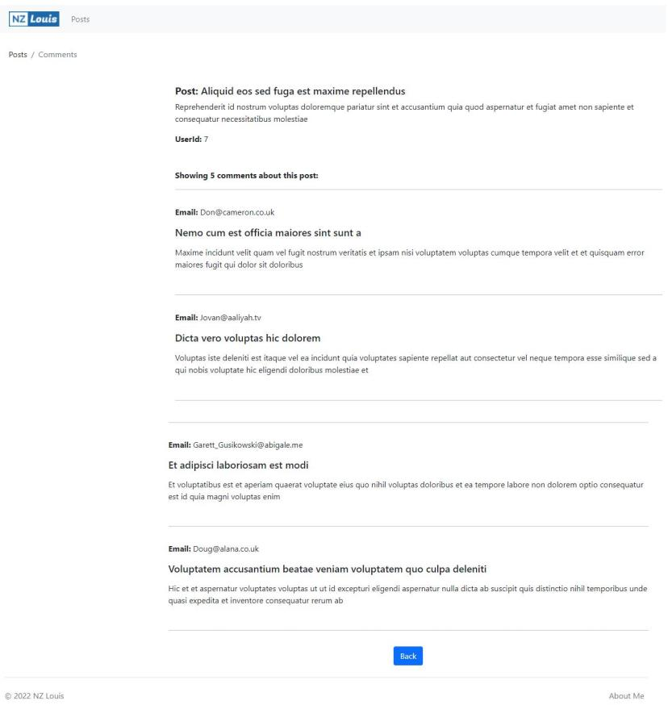

# react-post-comment

This is an online commenting system, implemented using react and react-bootstrap. Contains functions such as posts and comments. The system uses many reusable components to improve the reusability of the project.

## Getting started

You can view a live demo over at http://nzlouis.com:3000

To get the frontend running locally:

- Clone this repo
- `npm install` to install all req'd dependencies
- `npm start` to start the local server (this project uses create-react-app)
- `npm test` to start the local testing
